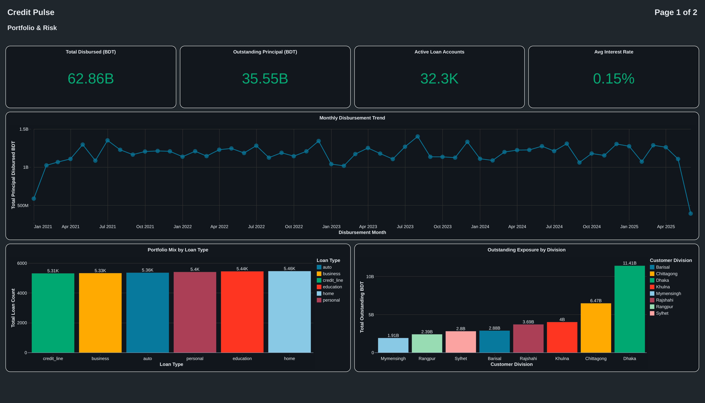

# CreditPulse

**A production-grade Retail Lending & Credit Risk data platform — built end-to-end on Databricks and Delta Lake, from synthetic data generation through a governed medallion architecture to a live executive dashboard.**

---

## Overview

CreditPulse simulates the core data infrastructure a retail bank runs its lending business on — from loan origination through repayment tracking, credit bureau integration, and delinquency/collections management. It's built as a genuine enterprise system, not a toy pipeline: every transformation is config-driven, every layer is auditable, and every design decision accounts for real-world constraints like data custody and platform limitations.

The project answers a deliberately realistic question: *if you had to build the data platform that tells a bank whether its loan book is healthy, how would you actually do it?*

## Architecture

The defining design decision of this project: **all data physically resides in a self-hosted, on-premises MinIO object store — never in a cloud vendor's storage.** Databricks is treated purely as a compute engine that processes data in transit; nothing it touches is allowed to become the authoritative copy. For a banking platform, this isn't a stylistic choice — data residency and custody requirements are a real regulatory concern for financial data, and this architecture is built to satisfy that from the ground up rather than bolt it on afterward.

```
                    ON-PREMISES (self-hosted, durable system of record)
                    ================================================
                    MinIO Object Storage
                    - raw landing data
                    - bronze/ silver/ gold/ buckets (durable exports)
                    ================================================
                              |              ^
                              | read         | write-back
                              v              |
                    ==========================================
                    DATABRICKS (compute only - disposable cache)
                    ==========================================
                    Bronze   -> Silver   -> Gold
                    (Delta / Unity Catalog, rebuildable from MinIO
                     at any time via the pipeline notebooks)
                              |
                              v
                    Databricks AI/BI Dashboard
                    (queries Gold via SQL Warehouse)
```

**The custody guarantee this enforces:** if the Databricks workspace were deleted entirely, every table in this platform could be rebuilt from MinIO plus the pipeline code alone — nothing is ever solely dependent on cloud-vendor storage. Every layer (Bronze, Silver, Gold) explicitly writes its finished output back to MinIO after processing; Databricks-managed Delta tables exist only to make querying and dashboarding fast, never as the source of truth.

## Data custody & compliance rationale

Banks operate under strict expectations — regulatory and otherwise — about where customer financial data is allowed to live and who controls the infrastructure it sits on. A common failure mode in "banking demo" projects is processing data entirely inside a third-party cloud platform and calling it done, without ever addressing where the data actually resides. CreditPulse is built specifically to avoid that:

- **Durable copy = self-hosted MinIO**, under direct infrastructure control, not a managed cloud storage bucket owned by a compute vendor.
- **Databricks = compute cache only.** Its managed storage is treated as ephemeral working space, explicitly documented and enforced through the export step at the end of every layer — never assumed to be safe to rely on long-term.
- **Full rebuildability** from MinIO + code is the actual test applied: at any point, the entire Bronze -> Silver -> Gold state can be regenerated from the durable layer alone.

This mirrors a real constraint production banking systems have to solve — separating durable data custody from wherever compute happens to run that quarter — rather than a project that only works as long as one vendor's platform is trusted to hold everything.

## What makes this an engineering project, not a dataset

- **Config-driven, not hardcoded.** Silver and Gold are each powered by a single generic engine that reads its rules — schema types, required fields, FK relationships, allowed values, aggregation definitions — from Delta control tables. Adding a new table or metric means inserting a config row, never touching pipeline code.
- **Referential integrity enforced, not assumed.** Every foreign key relationship is validated via anti-joins against parent tables at run time, with violations routed to quarantine tables tagged with the specific failure reason — never silently dropped.
- **Idempotent by design.** Silver writes use Delta `MERGE` keyed on primary key; re-running the pipeline against an unchanged snapshot updates rows in place rather than duplicating them.
- **Full audit trail.** Every pipeline run logs rows read, validated, and quarantined per table, with lineage columns (`_source_file`, `_batch_id`, `_ingested_at`) carried from Bronze through to Silver.
- **Realistic, correlated synthetic data.** Six relationally-consistent datasets generated with NumPy — credit score correlates with income, loan approval probability is a function of credit score/debt-to-income/KYC status, and payment behavior is driven by borrower risk segment. Not independent random noise dressed up as a spreadsheet.

## Tech stack

Databricks - Delta Lake - Unity Catalog - Apache Spark (PySpark) - MinIO (S3-compatible object storage) - Python - NumPy / Pandas - Databricks AI/BI (Lakeview)

## Datasets

| Table | Grain | Rows |
|---|---|---|
| `customers` | One row per borrower | 50,000 |
| `loan_applications` | One row per loan application | 80,000 |
| `loan_accounts` | One row per disbursed loan | ~32,000 |
| `repayment_schedule` | One row per EMI installment | ~2.17M |
| `credit_bureau_reports` | One row per bureau pull | ~125,000 |
| `collections_delinquency` | One row per delinquent case | ~25,000 |

## Dashboard

Two-page executive dashboard connected via Databricks SQL Warehouse:

- **Portfolio & Risk** — disbursement trends, portfolio mix, exposure by region, borrower risk distribution
- **Repayment, Collections & Credit Trend** — repayment performance over time, delinquency severity, collections funnel, bureau score trends




## Author

**Raihan Kabir** — Associate Data Engineer
Databricks - Delta Lake - Medallion Architecture - SQL-first Pipeline Design
